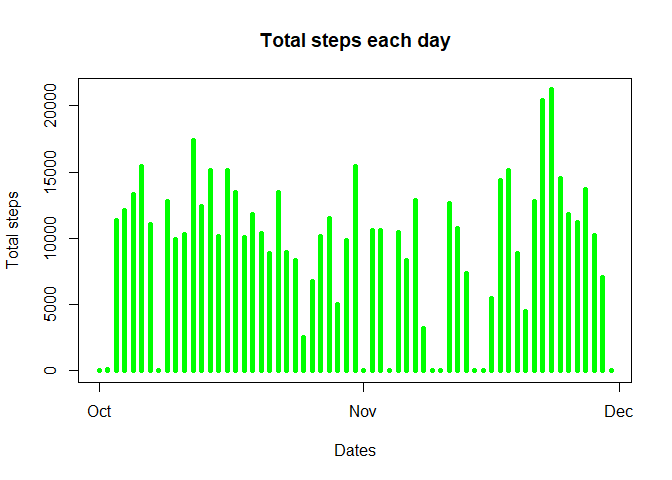
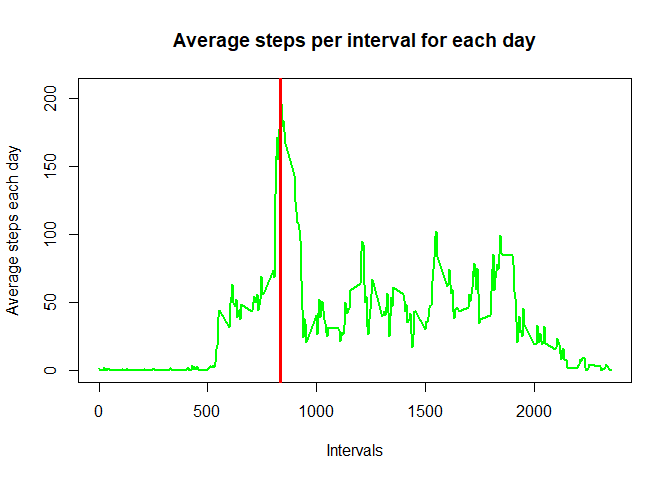
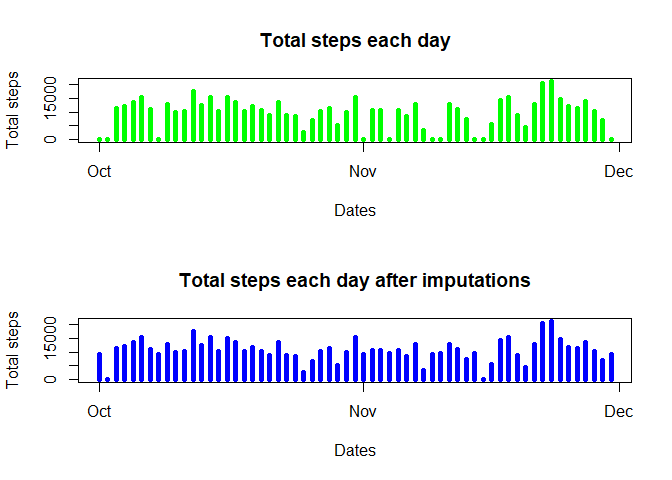
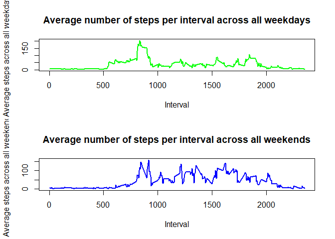

## Loading and preprocessing the data


```r
unzip("repdata_data_activity.zip")
activity <- read.csv("activity.csv")

## Converting the date variable to date format
activity$date <- strptime(activity$date, "%Y-%m-%d")
dates <- activity$date

## Creating a list of unique dates and intervals
uniqueDates <- unique(dates)
uniqueIntervals <- unique(activity$interval)
```


## What is mean total number of steps taken per day?


```r
# Generating a list to store the total step count corresponding to each day
step_split <- split(activity$steps, dates$yday)
total_daily_steps <- sapply(step_split, sum, na.rm = TRUE)

# Plotting the histogram for steps per day
plot(uniqueDates, total_daily_steps, main = "Total steps each day",
     xlab = "Dates", ylab = "Total steps", type = "h", lwd = 5, col = "green")
```

<!-- -->

```r
# Calculating the mean and meadian of total steps each day
daily_mean <- sapply(step_split, mean, na.rm = TRUE)
daily_mean_df <- data.frame(date = uniqueDates, daily_mean = daily_mean, 
                            row.names = NULL)
head(daily_mean_df)
```

```
##         date daily_mean
## 1 2012-10-01        NaN
## 2 2012-10-02    0.43750
## 3 2012-10-03   39.41667
## 4 2012-10-04   42.06944
## 5 2012-10-05   46.15972
## 6 2012-10-06   53.54167
```

```r
daily_median <- sapply(step_split, median, na.rm = TRUE)
daily_median_df <- data.frame(date = uniqueDates, daily_median = daily_median,
                              row.names = NULL)
head(daily_median_df)
```

```
##         date daily_median
## 1 2012-10-01           NA
## 2 2012-10-02            0
## 3 2012-10-03            0
## 4 2012-10-04            0
## 5 2012-10-05            0
## 6 2012-10-06            0
```


## What is the average daily activity pattern?


```r
# Split the data on intervals 
interval_split <- split(activity$steps, activity$interval)
average_steps <- sapply(interval_split, mean, na.rm = TRUE)

# Find the interval with maximum number of steps
max_interval <- max(average_steps, na.rm = TRUE)
max_interval_index <- as.numeric(which(average_steps == max_interval))
max_index <- uniqueIntervals[max_interval_index]

# Plot the time series plot
plot(uniqueIntervals, average_steps, type = "l",
     xlab = "Intervals", ylab = "Average steps each day",
     main = "Average steps per interval for each day",
     lwd = 2, col = "green")

# Plot the indicator of maximum value
abline(v = max_index, col = "red", lwd = 3)
```

<!-- -->


## Imputing missing values

There is a total of 61 days, and each day consists of 288 intervals. The vector *mean_column* is a replicated vector and matches the corresponding intervals on a particular day. Then the missing values are replaced using their corresponding means.


```r
# Total number of missing steps values
sum(is.na(activity$steps))
```

```
## [1] 2304
```

```r
# Stratergy : Replacing the missing values with its daily average

# Replacing the NAN values with 0
daily_mean[is.nan(daily_mean)] <- 0
mean_column <- rep(daily_mean, 288)
total_steps <- activity$steps
total_steps_na <- is.na(total_steps)
total_steps[total_steps_na] <- mean_column[total_steps_na]

# Creating a new dataset for imputed values
activitynew <- activity
activitynew$steps <- total_steps

# Split the data across days
step_split_new <- split(activitynew$steps, dates$yday)
total_daily_steps_new <- sapply(step_split_new, sum, na.rm = TRUE)

# Creating the plots with the treated data
# For comparision of the plots(original and treated)
par(mfcol = c(2,1))
plot(uniqueDates, total_daily_steps, 
     main = "Total steps each day",
     xlab = "Dates", ylab = "Total steps", type = "h", lwd = 5, col = "green")
plot(uniqueDates, total_daily_steps_new, 
     main = "Total steps each day after imputations",
     xlab = "Dates", ylab = "Total steps", type = "h", lwd = 5, col = "blue")
```

<!-- -->

```r
# Calculating the daily means and medians after imputations
daily_mean_new <- sapply(step_split_new, mean, na.rm = TRUE)
daily_mean_new_df <- data.frame(date = uniqueDates,
                                daily_mean = daily_mean,
                                daily_mean_new = daily_mean_new, 
                                row.names = NULL)
head(daily_mean_new_df)
```

```
##         date daily_mean daily_mean_new
## 1 2012-10-01    0.00000       32.33553
## 2 2012-10-02    0.43750        0.43750
## 3 2012-10-03   39.41667       39.41667
## 4 2012-10-04   42.06944       42.06944
## 5 2012-10-05   46.15972       46.15972
## 6 2012-10-06   53.54167       53.54167
```

```r
daily_median_new <- sapply(step_split_new, median, na.rm = TRUE)
daily_median_new_df <- data.frame(date = uniqueDates, 
                              daily_median = daily_median,
                              daily_median_new = daily_median_new,
                              row.names = NULL)
head(daily_median_new_df)
```

```
##         date daily_median daily_median_new
## 1 2012-10-01           NA         36.09375
## 2 2012-10-02            0          0.00000
## 3 2012-10-03            0          0.00000
## 4 2012-10-04            0          0.00000
## 5 2012-10-05            0          0.00000
## 6 2012-10-06            0          0.00000
```


## Are there differences in activity patterns between weekdays and weekends?

The approach to this problem was to create two dataframes, one for weekdays and other for weekends. Each dataframe consists of intervals and steps recorded. After this step, we will calculate mean steps at each interval for that given day for the two dataframes.


```r
wdays <- dates$wday
wday_vector <- rep(0, length(wdays) - 1)
wday_vector[wdays >= 1 & wdays <= 5] <- 0
wday_vector[wdays == 6 | wdays == 0] <- 1

# Creating a factor variable with labels "Weekdays" and "Weekends"
wday_factor <- factor(wday_vector, levels = c(0,1), 
                      labels =  c("Weekday", "Weekend"))

# Creating a new cloumn with labels and adding it
activitynew$daytype <- wday_factor
# Spliting up into two data frames
weekdays <- activitynew[activitynew$daytype == "Weekday", ]
weekends <- activitynew[activitynew$daytype == "Weekend", ]

# Ploting the time series plot
# Creating splits based on day type
weekdaysplit <- split(weekdays$steps, weekdays$interval)
weekendsplit <- split(weekends$steps, weekends$interval)

# Average steps for each day type
mean_steps_weekday <- sapply(weekdaysplit, mean)
mean_steps_weekend <- sapply(weekendsplit, mean)

# Creating the plots
par(mfcol = c(2, 1))
plot(uniqueIntervals, mean_steps_weekday, type="l",
     main="Average number of steps per interval across all weekdays", 
     xlab="Interval", ylab="Average steps across all weekdays", 
     lwd=2, col="green")
plot(uniqueIntervals, mean_steps_weekend, type="l",
     main="Average number of steps per interval across all weekends", 
     xlab="Interval", ylab="Average steps across all weekends", 
     lwd=2, col="blue")
```

<!-- -->

